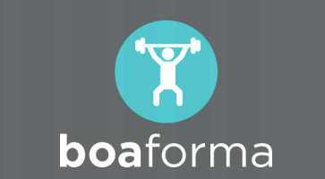

<h1 align="center">
    
</h1>

  

  
  
  
  
  

<h3 align="center"> Institutional health website. </h3>

<h3 align="center"> HTML 5,  CSS 3,  jQuery </h3>

---

## Technologies and tools

<ul>
    <li><a href="https://developer.mozilla.org/pt-BR/docs/Web/HTML/HTML5">HTML 5</a></li>
    <li><a href="https://developer.mozilla.org/pt-BR/docs/Archive/CSS3">CSS 3</a></li>
    <li><a href="https://materializecss.com/">Materialize</a></li>
    <li><a href="https://jquery.com/">jQuery</a></li>
    <li><a href="https://rockcontent.com/blog/wireframes/">Wireframe</a></li>
    <li><a href="https://www.w3schools.com/html/html_responsive.asp">Responsive</a></li>
</ul>

## Getting started

Clone this repository `https://github.com/annaflavia-castro/good-shape.git`

Move the index.html file at the root of the project to your browser.

## Screens

## License
This project is under the MIT license. See the [LICENSE](LICENSE.md) for details.

---

Made with ❤️ by <strong>Anna Flávia Castro

